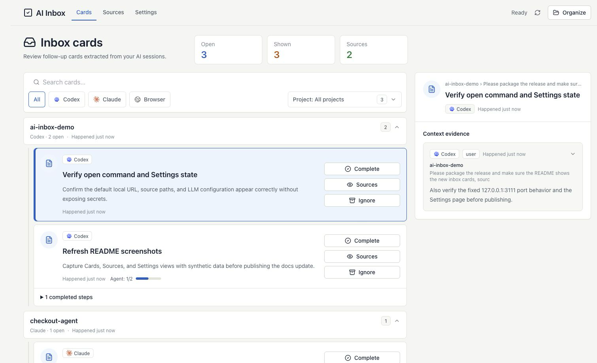

# AI-Index

[English](README.md) | [中文](README.zh-CN.md)

[](LICENSE)


**Local-first review workspace for follow-up cards extracted from AI and agent sessions.**

AI-Index is a local-first action inbox for AI sessions. It scans Codex, Claude Code, and browser sessions, uses your configured OpenAI-compatible LLM to extract unfinished work, and keeps source evidence available for review.

- Turn scattered AI-session loose ends into one reviewable card queue.
- Review source snippets before you complete, ignore, or restore a card.
- Keep config and data local by default under `~/.ai-index`.

### Requirements

- Installer: no Node.js install required
- Source checkout or future npm package: Node.js `>=22.16.0`
- An OpenAI-compatible Chat Completions API key

Without LLM configuration, AI-Index can still open the UI and scan sources, but it cannot organize sessions into todo cards.

### Install

Download the installer from [Releases](https://github.com/MaimoryLab/AI-Inbox/releases), then start it:

- macOS Apple Silicon: open `ai-index-macos-arm64.dmg`, then open `AI-Index.app`.
- Windows x64: run `ai-index-windows-x64.msi`, then open **AI-Index** from the Start menu.

AI-Index opens a local browser workspace. Configure sources and your LLM key in Settings, then click **Organize**.

The npm package is not published yet; use the installer or source checkout today.



### Source Checkout

From a fresh clone:

```bash
git clone https://github.com/MaimoryLab/AI-Inbox.git AI-Index
cd AI-Index
./scripts/start-local.sh
```

Then open [http://127.0.0.1:3111/](http://127.0.0.1:3111/).

The script runs `npm install`, `npm run build`, and `npm start`. If dependencies are already installed and built, use `npm start`.

`start` automatically discovers default Codex and Claude Code paths at startup and writes missing source settings. It does not overwrite paths you already configured. The default port is fixed at `3111`; if it is occupied, choose one explicitly:

```bash
npm start -- --port 3112
```

Use the web workspace for daily work:

1. In `Settings`, choose Chinese or English, check Codex/Claude Code path discovery, enter your API key, adjust look-back days and max sessions if needed, then save.
2. In `Sources`, review scanned sessions and source evidence.
3. In `To-Do`, click organize, review the generated cards, then mark them done or ignored.

### Screenshots

Screenshots below use synthetic session text, synthetic paths, and an empty API key field.


### Browser Extension

AI-Index includes an unpacked Chrome extension for capturing ChatGPT, Claude, Gemini, Perplexity, Grok, and DeepSeek browser sessions:

1. Start the web workspace and keep it running at `http://127.0.0.1:3111/`.
2. Open Chrome `chrome://extensions`, enable Developer mode, click `Load unpacked`, and select this repo's `browser-extension` directory.
3. Open a supported AI conversation.
4. Click the AI-Index extension, then `Sync Current Tab`.
5. Return to AI-Index, open `Sources`, and organize when the browser session appears.

The extension defaults to `http://127.0.0.1:3111`. Use its `Options` link if you started AI-Index on another port.

### CLI Usage

If you prefer the terminal, you can use only the CLI:

```bash
npm install
npm run build
AI_INDEX_HOME=.local/ai-index node dist/cli.js init --api-key <your-key>
AI_INDEX_HOME=.local/ai-index node dist/cli.js doctor
AI_INDEX_HOME=.local/ai-index node dist/cli.js scan codex
AI_INDEX_HOME=.local/ai-index node dist/cli.js scan claude-code
AI_INDEX_HOME=.local/ai-index node dist/cli.js organize
AI_INDEX_HOME=.local/ai-index node dist/cli.js list
```

| Command | Purpose |
| --- | --- |
| `init --api-key <key>` | Create local config and save the LLM key |
| `doctor` | Check config, data directory, and database |
| `start [--port <n>]` / `open [--port <n>]` | Start the web workspace |
| `scan <codex\|claude-code> [path]` | Scan a source |
| `extract` / `organize` | Ask the LLM to extract todo cards |
| `list` / `ls` | Print current todos |
| `done <id>` / `complete <id>` | Mark a card complete |
| `ignore <id>` / `dismiss <id>` | Ignore a card |
| `mcp` | Start the MCP stdio server |

### Configuration

The default config directory is `~/.ai-index`. Set `AI_INDEX_HOME` to use another location:

```bash
AI_INDEX_HOME=.local/ai-index npm start
```

Windows PowerShell:

```powershell
$env:AI_INDEX_HOME = ".local\ai-index"
ai-index start
```

The web `Settings` page and CLI read and write the same `.env` config. Common fields:

```bash
AI_INDEX_CODEX_HOME=~/.codex
AI_INDEX_CLAUDE_HOME=~/.claude/projects
AI_INDEX_LLM_ENDPOINT=https://api.novita.ai/openai/v1
AI_INDEX_LLM_MODEL=deepseek/deepseek-v4-flash
AI_INDEX_LLM_API_KEY=<your-key>
AI_INDEX_ORGANIZE_SINCE_DAYS=7
AI_INDEX_ORGANIZE_MAX_SESSIONS=16
```

Copy `.env.example` only into your local config directory, not the repo root, when you want a starting point for file-based config.

The UI language preference is saved in browser local storage, not in `.env`.

### Sources and Privacy

- Codex: scans `sessions` and `archived_sessions` under `~/.codex` by default.
- Claude Code: scans `~/.claude/projects` by default.
- Browser: the Chrome extension posts captured browser sessions to `POST /api/browser-sessions` while the web server is running.

AI-Index stores its database, config, and source records locally by default. During `organize`, relevant session snippets are sent to your configured LLM endpoint. Scanning imports session text and readable attachment references; it does not copy attachment files. Do not commit `.env`, `data/`, `.local/`, or real session records.

### Contributing

Issues and pull requests are welcome. Please keep reports and fixtures sanitized: no API keys, tokens, sensitive local paths, or real session transcripts. Before opening a PR, run:

```bash
npm test
npm run build
git diff --check
```

### License

Apache-2.0. See [LICENSE](LICENSE).
