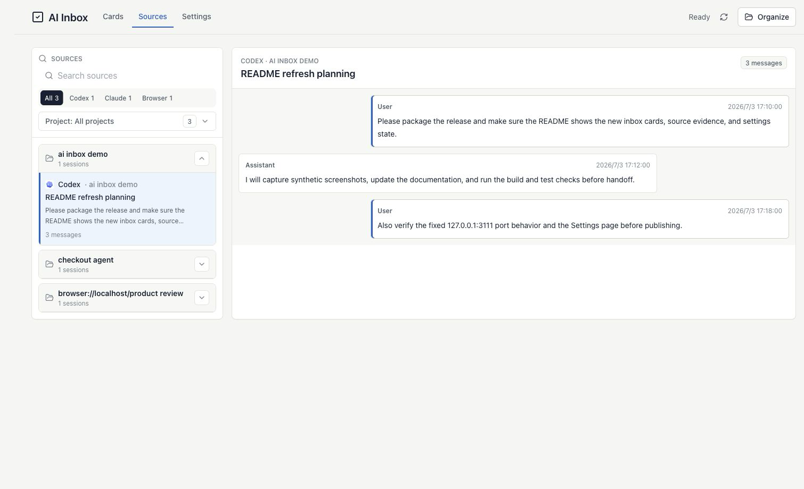
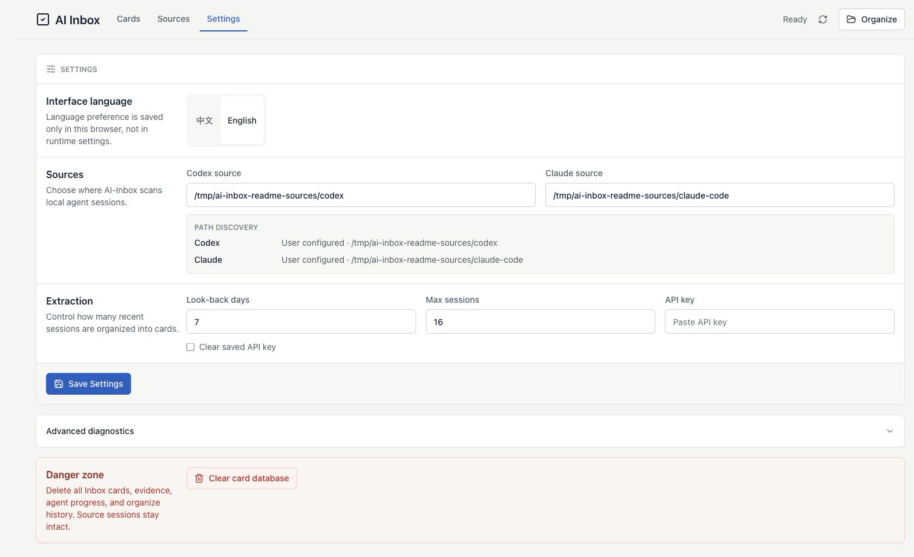

# AI-Inbox

[English](README.md) | [中文](README.zh-CN.md)

[](LICENSE)


**本地优先的 AI / Agent 会话卡片复查工作台。**

AI-Inbox 会扫描 Codex 和 Claude Code 会话记录，调用你配置的 OpenAI-compatible LLM 抽取 Inbox cards，并把每张卡片都关联回原始证据。

- 把分散在 AI 会话里的后续事项收进一个可复查的卡片队列。
- 在完成、忽略或恢复卡片前，先查看对应的来源片段。
- 配置和数据默认留在本机 `~/.ai-inbox`。

从 [Releases](https://github.com/MaimoryLab/AI-Inbox/releases) 下载 zip，然后启动：

```bash
# macOS Apple Silicon
unzip ai-inbox-macos-arm64.zip
cd ai-inbox-macos-arm64
./ai-inbox open
```

```powershell
Expand-Archive .\ai-inbox-windows-x64.zip -DestinationPath .
cd .\ai-inbox-windows-x64
.\ai-inbox.exe open
```

打开命令输出的本地 URL，在设置页配置来源和 LLM key，然后点击 **Organize / 整理**，卡片整理效果如下。


## 为什么需要 AI-Inbox

各种 AI 助手能推进很多事情，但后续事项经常埋在很长的聊天和 agent 日志里。AI-Inbox 给这些散落的线索加了一层复查工作台：抽成简洁的 Inbox cards，保留原始证据，再由你决定哪些真正需要处理。

它不是项目管理系统，而是一个本地优先的 AI 会话卡片复查入口。

## 会捕获什么

| 来源 | 默认位置 | AI-Inbox 导入内容 |
| --- | --- | --- |
| Codex | `~/.codex` | sessions 和 archived sessions |
| Claude Code | `~/.claude/projects` | 项目会话记录 |
| Browser | 计划中 | 浏览器插件和浏览器会话提取功能尚未实现，我们会尽快补齐。 |

扫描会导入会话文本和可读附件引用，不会复制附件文件。

## 快速开始

```bash
# macOS Apple Silicon
unzip ai-inbox-macos-arm64.zip
cd ai-inbox-macos-arm64
./ai-inbox open
```

```powershell
Expand-Archive .\ai-inbox-windows-x64.zip -DestinationPath .
cd .\ai-inbox-windows-x64
.\ai-inbox.exe open
```

npm 包尚未发布；当前请使用 release zip 或源码启动。

然后：

1. 打开命令输出的 `127.0.0.1` 本地 URL。
2. 在 **Settings / 设置** 中确认来源路径，并保存 OpenAI-compatible API key。
3. 在 **Sources / 来源** 中复查导入的会话。
4. 在 **Cards / 卡片** 中点击 **Organize / 整理**，查看生成的 Inbox cards。

没有 LLM 配置时，AI-Inbox 仍可以打开界面和扫描来源；只有配置好 LLM endpoint 和 key 后，才会生成 Inbox cards。

## 界面

以下截图全部使用合成会话文本、合成路径和空 API key 字段。

### Cards / 卡片


### Sources / 来源



### Settings / 设置



## 安装

### 环境要求

- Release zip：不需要安装 Node.js
- 源码启动或未来 npm 包：Node.js `>=22.16.0`
- 用于卡片抽取的 OpenAI-compatible Chat Completions API key

### Release Zip

从 [Releases](https://github.com/MaimoryLab/AI-Inbox/releases) 下载对应平台的 release zip，解压后在该目录运行：

```bash
# macOS Apple Silicon
unzip ai-inbox-macos-arm64.zip
cd ai-inbox-macos-arm64
./ai-inbox open
```

```powershell
Expand-Archive .\ai-inbox-windows-x64.zip -DestinationPath .
cd .\ai-inbox-windows-x64
.\ai-inbox.exe open
```

配置和数据仍保存在 `~/.ai-inbox`，不会写进 release 目录。当前 release 二进制未签名，macOS Gatekeeper 或 Windows Defender 可能会在首次运行时要求确认。

### npm

npm 包尚未发布。发布到公开 registry 后，这会是最短安装路径：

```bash
npm install -g @maimorylab/ai-inbox
ai-inbox open
npx @maimorylab/ai-inbox open
```

### 源码启动

```bash
git clone https://github.com/MaimoryLab/AI-Inbox.git
cd AI-Inbox
npm install
npm run build
npm start
```

macOS 或 Linux 也可以使用本地启动脚本：

```bash
./scripts/start-local.sh
```

`ai-inbox open` 和 `npm start` 默认使用 `127.0.0.1:3111`。如果端口被占用，请显式指定：

```bash
ai-inbox open --port 3112
npm start -- --port 3112
```

## 日常流程

1. 用 `ai-inbox open` 启动工作台。
2. 需要调整来源路径、回看天数、最大会话数或 LLM 配置时，进入 **Settings / 设置**。
3. 用 **Sources / 来源** 确认扫描结果并查看原始上下文。
4. 用 **Cards / 卡片** 整理近期会话，查看证据，完成卡片，忽略噪音，或恢复卡片。
5. 不要提交本地 `.env`、数据库或真实会话记录。

## CLI 常用命令

```bash
ai-inbox init --api-key <your-key>
ai-inbox doctor
ai-inbox scan codex
ai-inbox scan claude-code
ai-inbox organize
ai-inbox list
```

| 命令 | 用途 |
| --- | --- |
| `init [options]` | 创建本地配置，可选择保存 LLM key |
| `doctor` | 检查配置、数据目录、数据库和 LLM 设置 |
| `scan <codex\|claude-code> [path]` | 扫描指定来源路径 |
| `extract` / `organize` | 调用配置好的 LLM 抽取 Inbox cards |
| `regenerate --yes` | 清空卡片并基于全部 observations 重新生成 |
| `list` / `ls` | 打印当前卡片 |
| `done <card-id>` / `complete <card-id>` | 标记卡片完成 |
| `ignore <card-id>` / `dismiss <card-id>` | 忽略卡片 |
| `restore <card-id>` / `reopen <card-id>` | 把卡片恢复为打开状态 |
| `start [--port <n>]` / `open [--port <n>]` | 启动本地 Web 工作台 |
| `mcp` | 启动 MCP stdio server |

隔离测试可以指定 `AI_INBOX_HOME`：

```bash
AI_INBOX_HOME=.local/ai-inbox node dist/cli.js init
AI_INBOX_HOME=.local/ai-inbox node dist/cli.js doctor
```

## 配置

默认配置目录是 `~/.ai-inbox`。

```text
~/.ai-inbox/
  .env
  data/
    ai-inbox.sqlite
```

设置 `AI_INBOX_HOME` 可以改到其他位置：

```bash
AI_INBOX_HOME=.local/ai-inbox ai-inbox open
```

Windows PowerShell：

```powershell
$env:AI_INBOX_HOME = ".local\ai-inbox"
ai-inbox open
```

Web 设置页和 CLI 读写同一个 `.env` 配置。常见字段：

```bash
AI_INBOX_CODEX_HOME=~/.codex
AI_INBOX_CLAUDE_HOME=~/.claude/projects
AI_INBOX_LLM_ENABLED=true
AI_INBOX_LLM_PROVIDER=openai
AI_INBOX_LLM_MODEL=deepseek/deepseek-v4-flash
AI_INBOX_LLM_ENDPOINT=https://api.novita.ai/openai/v1
AI_INBOX_LLM_API_KEY=<your-key>
AI_INBOX_ORGANIZE_SINCE_DAYS=7
AI_INBOX_ORGANIZE_MAX_SESSIONS=16
```

如果需要文件配置模板，只把 `.env.example` 复制到本地配置目录。不要把真实 key 放在仓库根目录。

界面语言偏好只保存在当前浏览器，不写入 `.env`。

## 隐私边界

- AI-Inbox 本地优先：配置、数据库和扫描记录默认留在 `~/.ai-inbox`，除非你覆盖 `AI_INBOX_HOME`。
- 扫描和复查阶段，会话文本保留在本机。
- 浏览器插件尚未实现，所以当前 AI-Inbox 不会自行采集浏览器会话。
- 执行 `organize` 时，相关片段会发送到你配置的 LLM endpoint 用于抽取。
- API key 只应保存在本地配置中，不能提交。
- README 截图和测试样例必须使用合成或充分脱敏的内容。

## 排障

| 问题 | 处理方式 |
| --- | --- |
| `3111 is already in use` | 运行 `ai-inbox open --port 3112`，或指定另一个明确端口。 |
| 没有生成卡片 | 运行 `ai-inbox doctor`，确认 API key 和 endpoint，再重新执行 `ai-inbox organize`。 |
| 来源为空 | 检查 `AI_INBOX_CODEX_HOME`、`AI_INBOX_CLAUDE_HOME`，或运行 `ai-inbox scan <source> [path]`。 |
| Finder 里找不到 `~/.ai-inbox` | macOS 默认隐藏点目录。使用 Finder 的 **前往文件夹**，输入 `~/.ai-inbox`。 |
| npm 找不到包 | 在公开 npm 包可用前，使用源码启动或 release zip。 |
| Release 二进制被系统拦截 | 在系统安全提示中确认未签名二进制，或使用 Node.js 从源码运行。 |

## 开源贡献

欢迎提交 issue 和 pull request。报告、测试样例、截图和文档必须适合公开：不要包含 API key、token、私人路径、真实姓名或真实会话记录。

提交 PR 前请运行：

```bash
npm test
npm run build
git diff --check
```

## 许可证

Apache-2.0。见 [LICENSE](LICENSE)。
